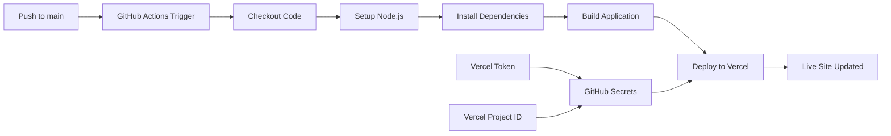

# Design Document

## Overview

This design implements automated deployment of the Next.js portfolio website to Vercel using GitHub Actions. The solution uses Vercel's official GitHub Action along with secure token-based authentication to create a continuous deployment pipeline that triggers on pushes to the main branch.

## Architecture

The deployment architecture consists of three main components:

1. **GitHub Actions Workflow**: Orchestrates the build and deployment process
2. **Vercel Platform**: Hosts the deployed application
3. **GitHub Secrets**: Securely stores authentication tokens



## Components and Interfaces

### GitHub Actions Workflow

- **File Location**: `.github/workflows/deploy.yml`
- **Trigger**: Push events to main branch
- **Runner**: Ubuntu latest
- **Node Version**: 18.x (LTS)

### Required GitHub Secrets

- `VERCEL_TOKEN`: Personal access token from Vercel account
- `VERCEL_ORG_ID`: Organization ID from Vercel
- `VERCEL_PROJECT_ID`: Project ID from Vercel

### Vercel Configuration

- **Framework**: Next.js (auto-detected)
- **Build Command**: `npm run build`
- **Output Directory**: `.next` (default)
- **Install Command**: `npm ci`

## Data Models

### Workflow Configuration Structure

```yaml
name: Deploy to Vercel
on:
  push:
    branches: [main]
jobs:
  deploy:
    runs-on: ubuntu-latest
    steps:
      - name: Checkout
      - name: Setup Node.js
      - name: Install dependencies
      - name: Build application
      - name: Deploy to Vercel
```

### Environment Variables

- `VERCEL_TOKEN`: Authentication token (secret)
- `VERCEL_ORG_ID`: Organization identifier (secret)
- `VERCEL_PROJECT_ID`: Project identifier (secret)
- `NODE_VERSION`: Node.js version (18.x)

## Error Handling

### Build Failures

- **Detection**: Exit code from `npm run build`
- **Response**: Fail workflow, prevent deployment
- **Logging**: Full build output in GitHub Actions logs

### Deployment Failures

- **Detection**: Vercel CLI exit codes
- **Response**: Fail workflow with error details
- **Retry Logic**: GitHub Actions automatic retry on infrastructure failures

### Authentication Failures

- **Detection**: 401/403 responses from Vercel API
- **Response**: Clear error message about token validity
- **Resolution**: Instructions to regenerate tokens

### Network/Infrastructure Failures

- **Detection**: Timeout or connection errors
- **Response**: Automatic retry by GitHub Actions
- **Fallback**: Manual deployment instructions in documentation

## Testing Strategy

### Pre-deployment Validation

- **Lint Check**: Run `npm run lint` before build
- **Build Verification**: Ensure `npm run build` completes successfully
- **Dependency Audit**: Check for security vulnerabilities

### Post-deployment Verification

- **Health Check**: Verify deployment URL returns 200 status
- **Smoke Test**: Basic functionality verification
- **Performance Check**: Lighthouse CI integration (optional)

### Workflow Testing

- **Branch Protection**: Test that non-main branches don't trigger deployment
- **Secret Validation**: Verify all required secrets are present
- **Rollback Testing**: Ensure previous deployments remain accessible

## Security Considerations

### Token Management

- Use GitHub Secrets for all sensitive data
- Rotate Vercel tokens periodically
- Limit token permissions to minimum required scope

### Access Control

- Restrict workflow to main branch only
- Use environment protection rules if needed
- Audit deployment logs regularly

### Code Security

- No secrets in repository code
- Use official Vercel GitHub Action
- Pin action versions for security

## Implementation Notes

### Vercel Project Setup

1. Create Vercel project linked to GitHub repository
2. Configure build settings (auto-detected for Next.js)
3. Generate deployment tokens with appropriate permissions

### GitHub Repository Setup

1. Add required secrets to repository settings
2. Configure branch protection rules for main branch
3. Set up workflow file in `.github/workflows/`

### Monitoring and Maintenance

- Monitor deployment success rates
- Update action versions regularly
- Review and rotate access tokens quarterly
